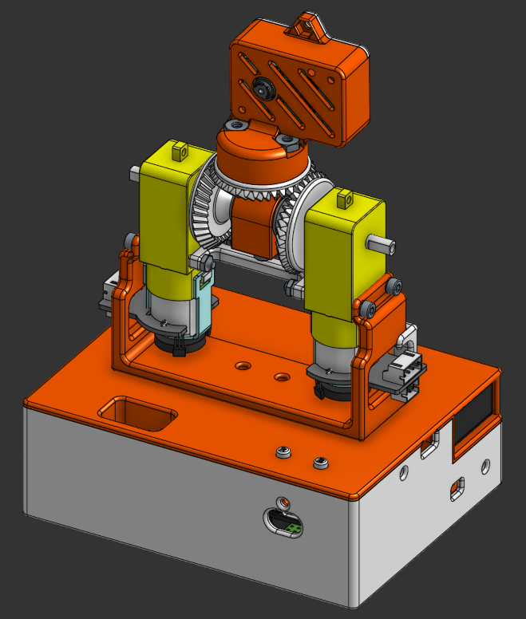

# Laser-Pointer-Robot
## To do
- [ ] buy time of flight sensor
- [ ] increase camera fps
- [ ] alter camera enclosure
- [ ] figure out what to do about power cable to camera
- [ ] create electronics mounting plate

## CAD
[Link to Onshape Folder](https://cad.onshape.com/documents?resourceType=folder&nodeId=37651e437204c166a238473c&column=modifiedAt&sortOrder=desc)  

## Electronics

## Differential Drive BOM
- [Motor Driver Board](https://www.amazon.com/dp/B0CR6BX5QL?ref=ppx_yo2ov_dt_b_fed_asin_title) - $7.56

- [Flange Bearings](https://www.amazon.com/uxcell-FR188-2RS-Flanged-Bearing-Bearings/dp/B0CH2KNZK3?crid=KAN1DN9HU66I&dib=eyJ2IjoiMSJ9.oatM0n0XHPjPX3KqxT_fdQ5LujwPzVgHt7Ss8elS6r4-rSImq-vl3jRYdJxpptBOu5J7J0ZE_oC_YXcsO-80yFbO-3r1y1JCTCfX2-hVOQO-YIiy5C8dMWfNQADPJLkLJb99OpXb49-wbTUREpSF6w2UT5m9EfOVPfnMoImSSDDyg36SzMb6oFj2NQqenC0OFL7XCxI16ifCNmfjiPoK1qNR-10bTL84wL1z8EHfWFQ.55QEYc-zzSvODLFBeKzaVGh80APjvewgnUyUXzsfM30&dib_tag=se&keywords=1%2F4%22+x+1%2F2%22+x+3%2F16+flange+bearing&qid=1751247610&sprefix=1%2F4+x+1%2F2+x+3%2F16+flange+bearin%2Caps%2C142&sr=8-6#averageCustomerReviewsAnchor) - $7.24

- [Motors](https://www.digikey.com/en/products/detail/dfrobot/FIT0450/7597205?gQT=1) - $27.22

- [ESP-32](https://www.amazon.com/ESP-WROOM-32-Development-Dual-Mode-Microcontroller-Compatible/dp/B0D53M13NS?pd_rd_w=9ZuXm&content-id=amzn1.sym.cd152278-debd-42b9-91b9-6f271389fda7&pf_rd_p=cd152278-debd-42b9-91b9-6f271389fda7&pf_rd_r=GRGSMHH0YJ5MWP9M59Q4&pd_rd_wg=0xmzY&pd_rd_r=e8ca0407-d647-4691-b62d-3561c9175cae&pd_rd_i=B0D53M13NS&th=1) - $12.98

- [ESP-32-CAM](https://www.amazon.com/Aideepen-ESP32-CAM-ESP32-CAM-MB-CH-340G-NodeMCU/dp/B0CMTVFCYD?pd_rd_w=n9FEv&content-id=amzn1.sym.cd152278-debd-42b9-91b9-6f271389fda7&pf_rd_p=cd152278-debd-42b9-91b9-6f271389fda7&pf_rd_r=1CBXD4K4JJS57ZXWZ5K8&pd_rd_wg=mnlfX&pd_rd_r=58660645-7fac-4404-86e3-537b3f61101a&pd_rd_i=B0CMTVFCYD&th=1) - $12.98

- [Time of flight sensor](https://www.amazon.com/HiLetgo-VL53L0X-Distance-Measurement-Breakout/dp/B071DW8M8V?crid=26CANEVB9M2UA&dib=eyJ2IjoiMSJ9.EN7iXRSOt_f7EU_xuqehb6bGzHOfTzMaPJZLolsOhSE1mQ7SS9bqAYjbA0PJpcsmP80iR0KADen_6NaBtSMJ--W1GTvLJbOrZBELzrftDIV63ihffeYLOXwC8dnW1_dR1K2eqSAKrX7_3Q-FljZ7tvfkonknpGddfxLWjb-13lMTlVoP4VCVRTWbFgqUBdo-EGVLOobiIhTrAhkTCI0A6JwPqq2g-bW3kMX9BaZ9W_D7qWGZqBYTmvkv06G4UyLZjyA2dd_LJfPDYsntWk268M6h0lVhWvANr_28ZW6Ul34.NRGbMzWDEqP0bryEXdxZshDlA5QsHoPb10iOyGyM5AI&dib_tag=se&keywords=vl53l0x+sensor&qid=1751313333&sprefix=VL53L0X%2Caps%2C128&sr=8-11#averageCustomerReviewsAnchor) - $6.79

- [Batteries](https://www.amazon.com/JUZUXI-Rechargeable-Connector-Compatible-Quadcopter/dp/B0DCNN87NZ?crid=1BLIO53WK82OU&dib=eyJ2IjoiMSJ9.eYr12WLi6bk1MDEIM3AtFBmA4_ydTCXN5-op04udKf8V_jwmVFkX7Leax4bhHvy7fUU-edodoNCyrhVLECv9ZsgA6KeyKkYW9-gjaiXN-sexFOk1i4SY5R8zCPX9x753QIy5imTUPNhW2hq11JZk2BT0fjssbw6YikIYeAZO0kXPw_ocMXOH6OGDUWnyU9f_n2tp52DK3mDwp6hbpSrKOlHepX8WV4RRCx3y41yXeApqW793r-t-kbYChWSWsEG7n4rWKo8F4K72BVoJdrMJQ8pHGJh0R9dhIex2UymxZ_Y.FK12zBUBF275pOnF70epmiTt_tySmUa4Y7pjw7Ngwk0&dib_tag=se&keywords=2s%2Blipo%2Bbattery%2Band%2Bcharger&qid=1751341234&sprefix=2s%2Blipo%2Bbattery%2Band%2Bcharger%2Caps%2C139&sr=8-17&th=1) - $17.99

- [Buck converter](https://www.amazon.com/Converter-Adjustable-Regulator-Voltmeter-Display%EF%BC%88Pack/dp/B0F1M2SR31?crid=1EOYSLZX2J4PY&dib=eyJ2IjoiMSJ9.WFmcMhr5wKG96ZSaMiTTM3Rk3hGcs4Yrw2gcYfWnbx0ZowT_5YmQO2gRxsGOGVqLCN2fWbkwPqU9Q1j7T_Jx0zWI86ihngTihciOiq0XkFQrBRyQ3ecXoOsMy6PZcK--ndXGiCltqv80zyV03yGiSdrgZxOZvxaoql6QG5GR8mNndIP6dBLmBB82gX0ir067DyO8iL7iOiXBMQC4DIZgjQpTBu5AH0KJUc03CnhvA4Gm48zMWavzZ6MHZnxkoBybULSZMuK4x41Z0M4-ZJP7NVP1lvyYOPYXN7FRYj0CPLI.U2brYK_R95NuAvd8chyqYuLHba5CnVMY267DfeE9Alk&dib_tag=se&keywords=LM2596%2Bbuck%2Bconverter&qid=1751341145&s=electronics&sprefix=lm2596%2Bbuck%2Bconverter%2Bdisplay%2Celectronics%2C252&sr=1-8&th=1) - $7.99

- [Wheels](https://www.amazon.com/ThtRht-Motor-Wheels-Replacement-Smart/dp/B0CG1C7T8J?crid=1PKGH2WU5PFUA&dib=eyJ2IjoiMSJ9.ZrpNmrbicccc2COTV1s2mA9WoJ1DIenbM3cm4ELldtSWugJtx9H5OBLGENUTYFFMlC6O_5zXXe2FUy_6uJbvNwwANohFr5KnYgBUasKJuyWke1iPjHwYBhp4D9SHaLfDCvMaxAzw4fmaTe25qvc9wsKNkHHxZ7vJF0MgBEM7Snz0cF1OrxPffPRl5qvE1C3tEDTP2uA-ZGugOelWcl4dtOlsKqq2tmqK2mJ9uY5iHyjwlzKurELygKR8unm249wl-p8-efPSrcLdckJR9MSe2Vt8C93WIufyJ52xjVt3sH0.LKpFzldROazfCKJeXrzehNdedx1sp1oJZGIjJE000lI&dib_tag=se&keywords=tt+motor+wheel&qid=1751340564&sprefix=tt+motor+wheel%2Caps%2C137&sr=8-1#averageCustomerReviewsAnchor) - $8.97

### Hardware Needed
- 1/4-20 bolt x1
- 1/4-20 nut x1
- #8 bolt x2
- #8 nut x2
- 2.5 mm bolt x4
- 2.5 mm nut x4

## Budget
Running Total Spent: $96.16  
Predicted Total Cost: $109.72
